# Avaliação Sprint 1 - Programa de Bolsas Compass UOL / AWS - turma julho-a/2024

Avaliação da primeira sprint do programa de bolsas Compass UOL para formação em machine learning para AWS.

Desenvolvido por: João Henrique de Oliveira

***
## Objetivo do Projeto

O Principal objetivo do projeto, era desenvolver um sistema de cadastro de usuários, utilizando JavaScript e LocalStorage para armazenar os Dados dos usuários.


## Desenvolvimento do Projeto

O Projeto de certa maneira, foi bem simples de se fazer, pois já tinha conhecimento prévio das funcionalidades e também das ferramentas utilizadas (JS e LocalStorage).

Pelo fato do Projeto ser simples e não muito extenso, decidi por usar apenas a estrutura básica de pastas para Projetos Web, que consiste:

```
├── README.md 
├──.gitignore
├── src
  ├── index.html
  └── assets
        ├───css
        │ └── styles.css
        ├──js
          └── index.js
```

O Arquivo `index.html`, contém o HTML para criar a visualização da tela, onde há um formulário básico e uma tabela, para realizar a exibição dos usuários cadastrados.

O Arquivo `styles.css`, contem o CSS para realizar a estilização básica do arquivo HTML.

E por fim, e mais importante, o `index.js`, nele está toda a lógica do desenvolvimento e criação dos usuários, ele possui uma função principal que é executada quando o DOM é carregado, e algumas outras funções para realizar as necessidades do sistema.


## Funcionalidades

- Cadastro de usuários
- Exclusão de usuários
- Filtrar por nome de usuário


## Utilizando o Sistema

Clone o projeto ou baixe os arquivos direto pelo navegador.
```bash
  git clone https://link-para-o-projeto
```

Entre na pasta src do projeto.

```bash
  cd src
```
E basta abrir o arquivo index.html.

### Inicio
***
Ao abrir, você irá se deparar com essa tela, onde você conseguirá fazer tudo através dela:

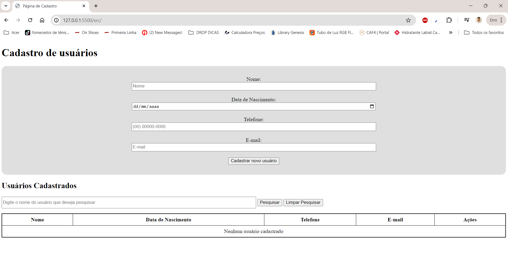

### Cadastrando um Usuário
***
Para cadastrar um usuário, basta Preencher todos os campos de maneira correta e clicar em cadastrar novo usuário:
> Lembretes:
* E-mail e Telefones são únicos para cada usuário, não podem ser repetidos
* Usuário deve ser maior de 18 anos para ser cadastrado

Caso esteja tudo nos conformes, um alerta confirmando a adição será exibido:

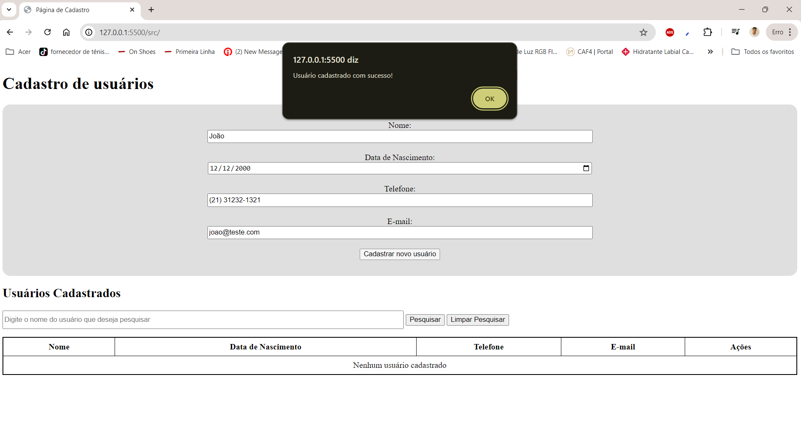

e Logo em seguida da confirmação, o usuário aparecerá na tabela

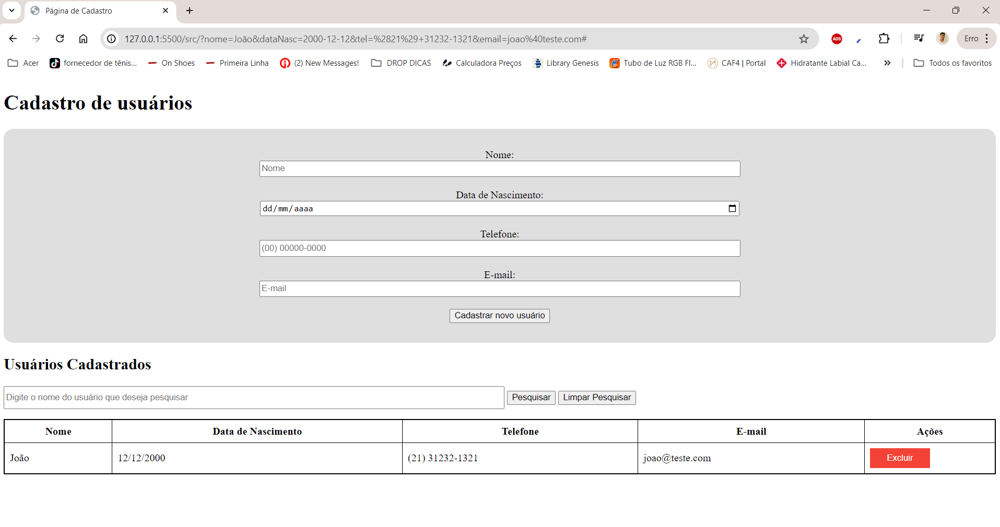

### Excluindo usuário
***
Para excluir um usuário Desejado, basta clicar em Excluir na linah do usuário e logo em seguida confirmar o alerta com OK, da seguinte maneira:

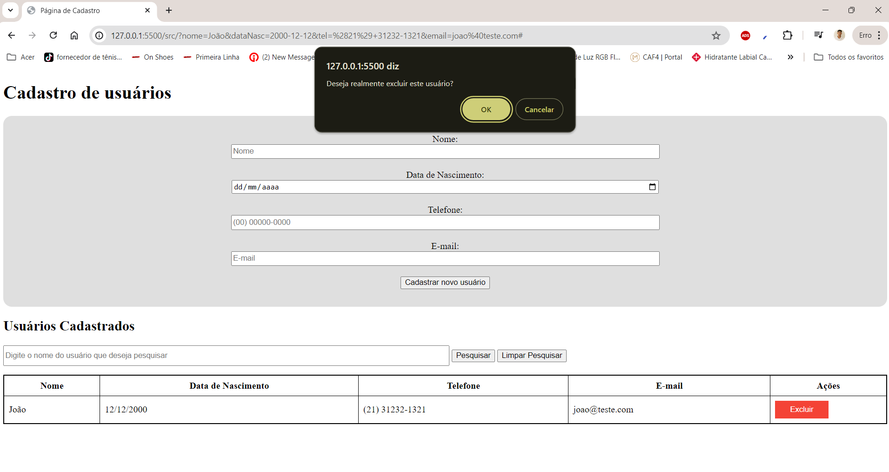

Um Alerta de Confirmação será emitido

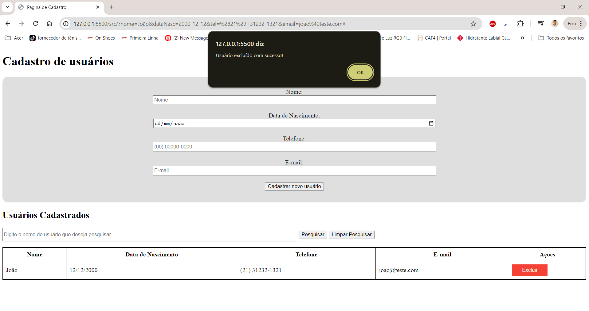

E Depois o mesmo será removido

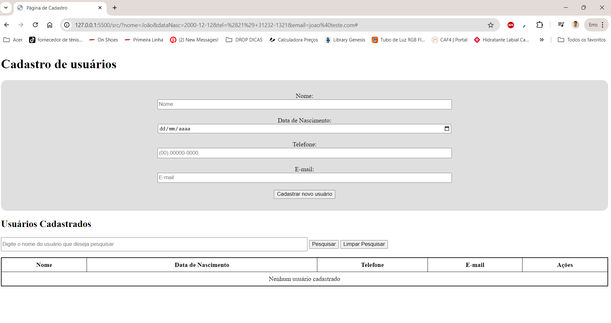

**Caso você tenha cancelado a operação**

Apenas irá mostrar um alerta e nada acontecerá
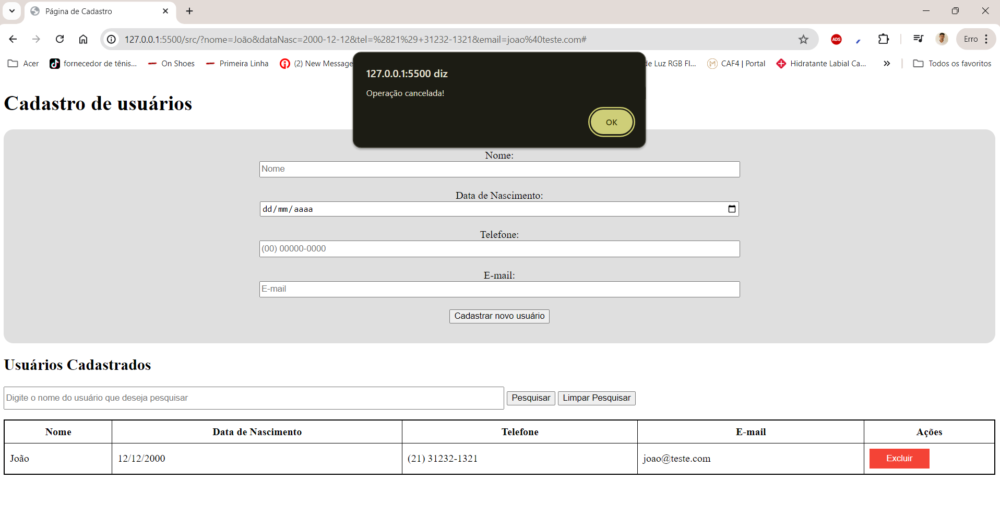


### Possíveis Erros ao cadastrar usuário
***
Caso tente cadastrar um usuário menor de 18 anos, o sistema irá emitir um alerta e reiniciar a operação de cadastrado

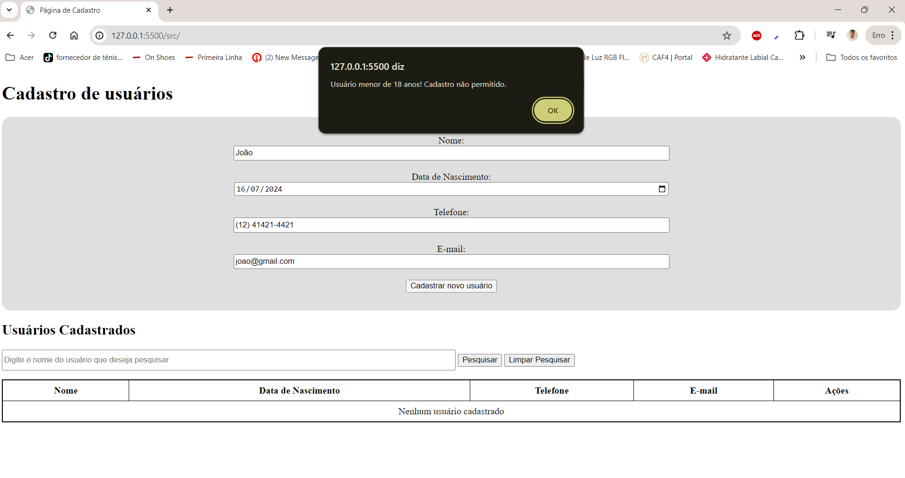

### Filtrando Usuário
***
Caso tenha mais que um usuário e deseje pesquisar/filtrar pelo nome, basta você digitar o nome do usuário e Clicar em Pesquisar que aparececerá somente os usuários que forem iguais ao que você digitou:

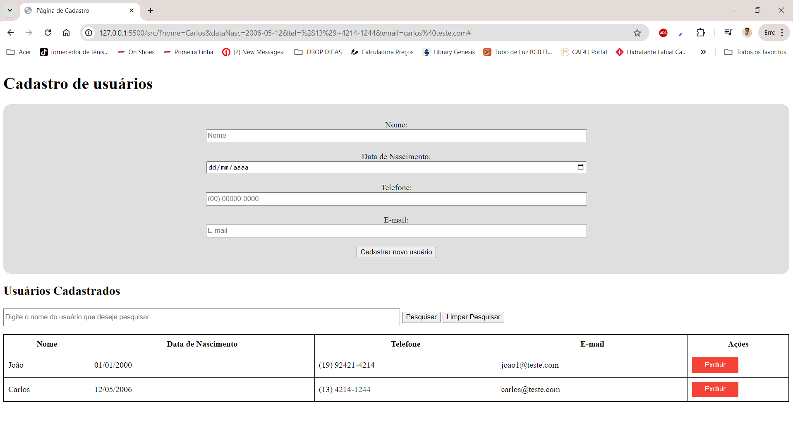

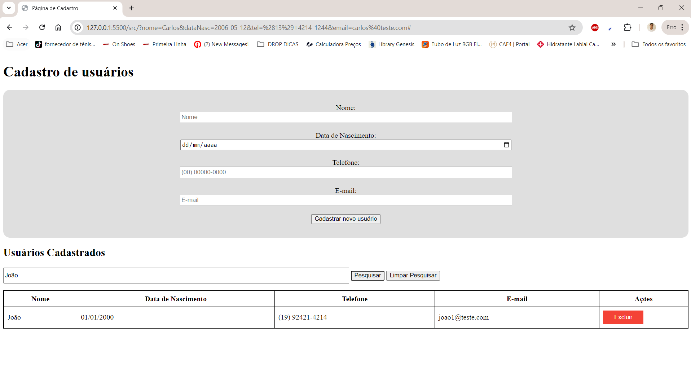

Caso deseje remover o filtro, basta clicar em limpar pesquisa e pronto, voltrá ao normal


### Outros possíveis erros
***
Caso você tente adicionar um usuário no qual ja tenha email e/ou telefone cadastrado, o seguinte alerta irá aparecer: 

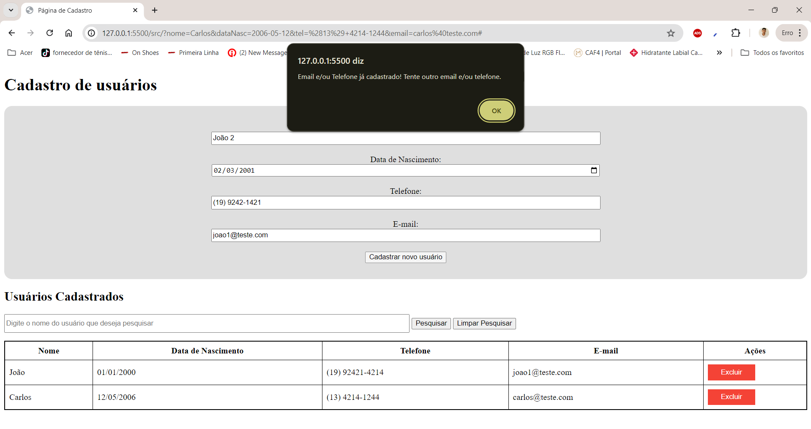


